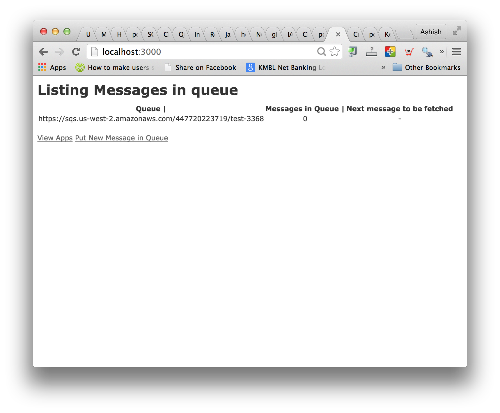
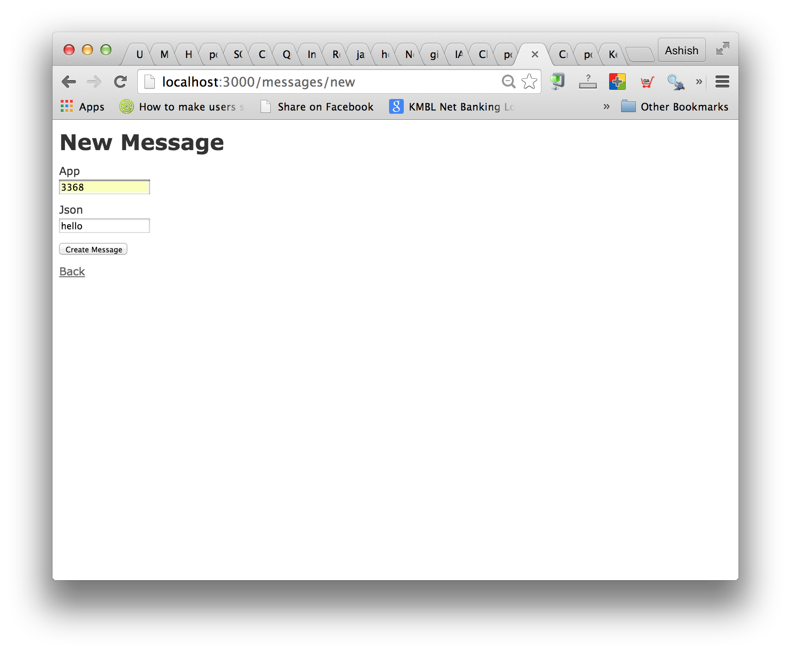
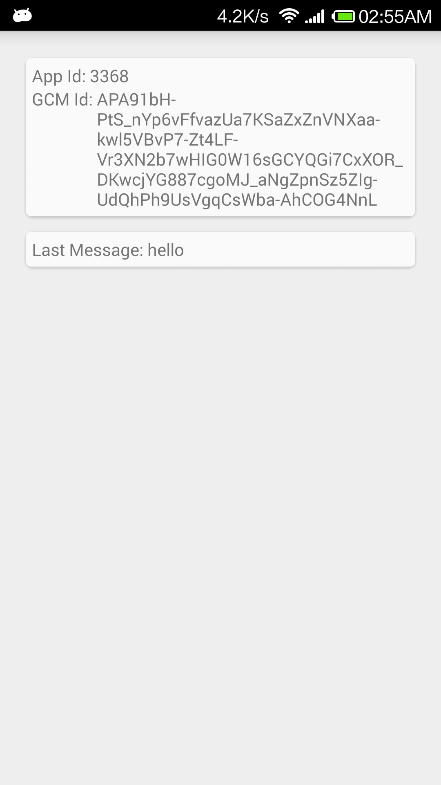
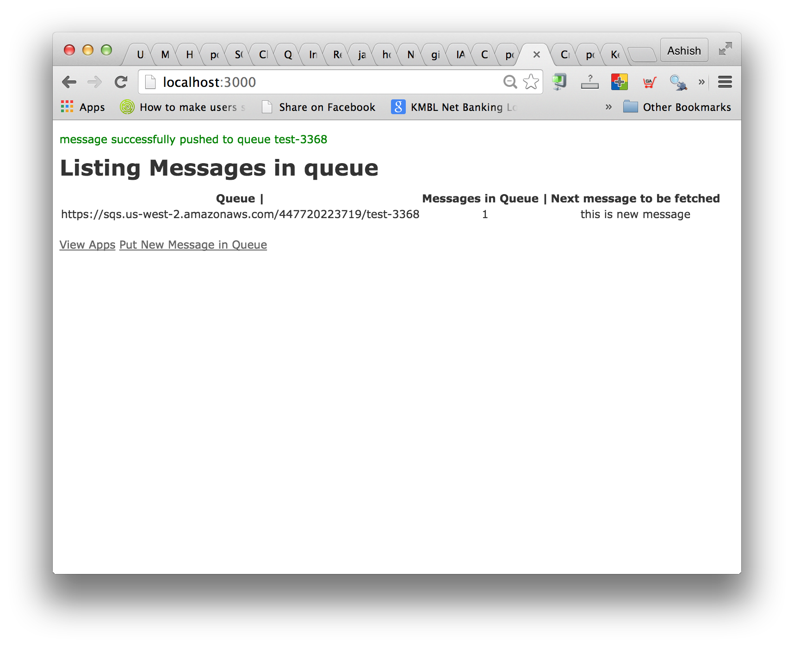
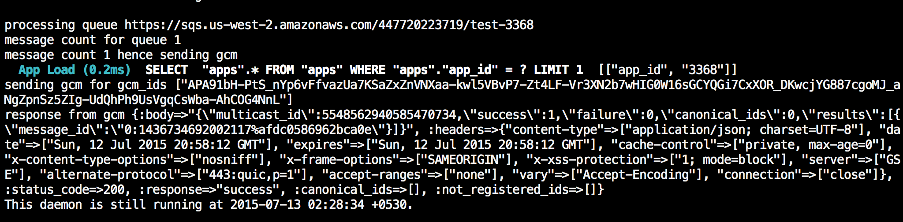

## Commu-SQS

This project is to demonstrate how to use Amazon SQS for a gauranteed & fastest server -> (Android) client communication. Usually, people use GCM for such cases but GCM message tend to get delayed. 

Here, one queue per Android client is created on Amazon SQS. Server inserts data to the queue. On Android, there is a persistent background service that keeps listening for data on the queue. On getting data, it generates a notification. 

In the event of user force closing the app, the background service will get killed. A daemon as part of the server (located in `libs/daemones/monitor_queue.rb`) keeps scanning all the queues. On finding pending data that has not been fetched, the daemon sends a **wake up GCM push** to the device. The push is received by the broadcast receiver, which in turn brings the killed background service to life. 

Note - no data is being passed in the GCM push as it would only increase the *data-duplication-check* overhead at the Android app. 

On top of the wake up push, in the Android client, a `BaseActivity` is created which checks if the service is running & starts it. Ideally, all your Activities should extend BaseActivity so that the service status is checked whenever any Activity is loaded (lets say from a different GCM push). 

### TO-DO 

I had plans to extend the service for upstream purpose (sending data from Android to server) but I am still in two-minds if this is the right approach. Ideally, `SyncAdapter` takes care of data transmission from client to server as it has inbuilt mechanism of checking when network connection is available etc. Comments on this are welcome. 

### Setup 

#### Rails server

Copy `config/app_environment_variables.rb.example` to `config/app_environment_variables.rb` & fill in the appropriate details. 

Deploy the rails app. Start the monitor\_queue as `rake daemon:monitor_queue:start`. Do `tail -f logs/*` to see all the logs. If the app is deployed on heroku, do `heroku logs -t`. 

For testing purpose, you may simply start the daemon as `ruby libs/daemon/monitor_queue.rb`. That way, you would know if the daemon is dying. There is a corner case when daemon dies when there are no queues. So start daemon once you have deployed the app. 

The server creates queues with prefix **test-** in development & **live-** in production environment. `Message.delete_queues` will delete all your queues. This is handy when you are resetting things to scratch in production mode. 

#### Android App

1. Import `android-app` directory in Android Studio.
2. Copy `AwsCredentials.java.example` as `AwsCredentials.java` & fill in the required details like AWS & GCM credentials.
3. Modify line 31 in MainActivity.java

    private static String SERVER_URL= "http://192.168.1.5:3000/";

3. Deploy maadi (thats Kannada for *do it*)

#### Seeing it in action

On opening the app, you would see the app generating a random app id & gcm id. The same is being sent to the server. Refresh the server to see a new queue being created.

Now push a message to the queue, the message should immediately come to the app with a notification. 

<table style="width:100%">
  <tr>
    <td style="width:66%"></td>
    <td style="width:33%"></td>
  </tr>
</table>

Try force closing the app, create a new message & keep checking the daemon logs. There should be a GCM message that would be sent from the server to Android app, which will wake up the app & starts the background service. The app will then register the new message. 

#### For your app

You do not need to incorporate all of the server parts. Your own server could push the data to SQS. You can use my server as daemon that scans for data in your SQS queues that are unfetched & then sends GCM.  

The `app/controllers/endpoint_controllers.rb` & `lib/daemons/monitor_queue.rb` is important. The other Messages controller is just for the purpose of showing the whole stuff in action. 

From the app side, make sure you do a http call to my server when the app registers app & gcm id. The server stores it & uses the gcm id to send the GCM push.

## Attribution

A large part of MessageService.java code in the Android app is taken from the Localoye Android app. I did this project while I was trying to evaluate to work with them. 

Let me know how you like it by dropping me a word at [@pocha](http://twitter.com/pocha) :-)
